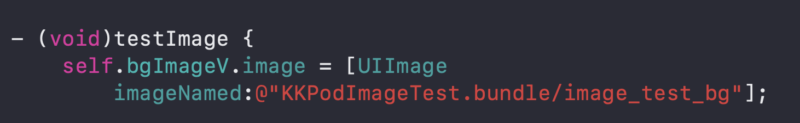
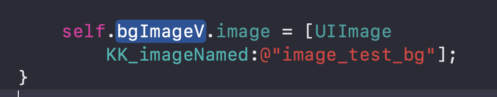
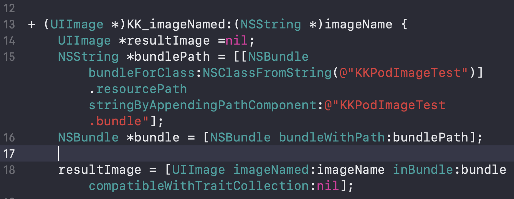
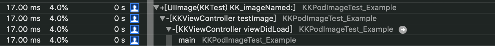
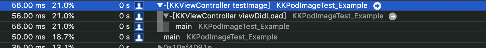
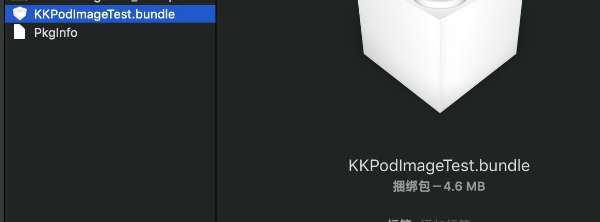
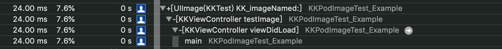
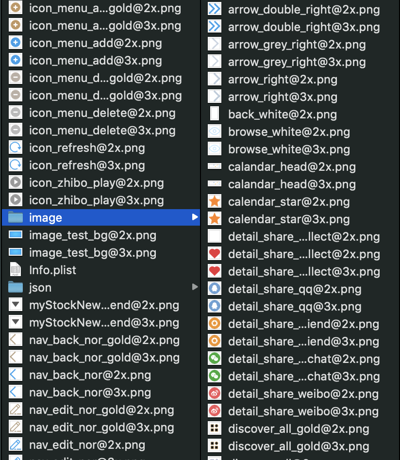
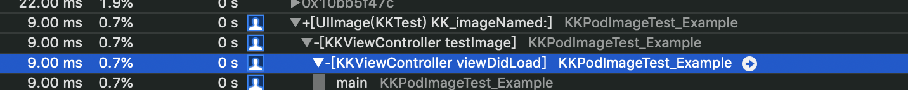
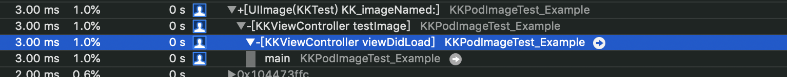

# KKPodImageTest
图片引用方式测试

单张图片引用测试
简单imageName

bundleName方法

多张图片

imageName

bundleName

稍微多了点

第二种方式

第三种方法

[UIImage imageNamed:imageName inBundle:bundle compatibleWithTraitCollection:nil]

[UIImage imageNamed:[NSString stringWithFormat:@"KKPodImageTest.bundle/%@",imageName]] 加载不出来

